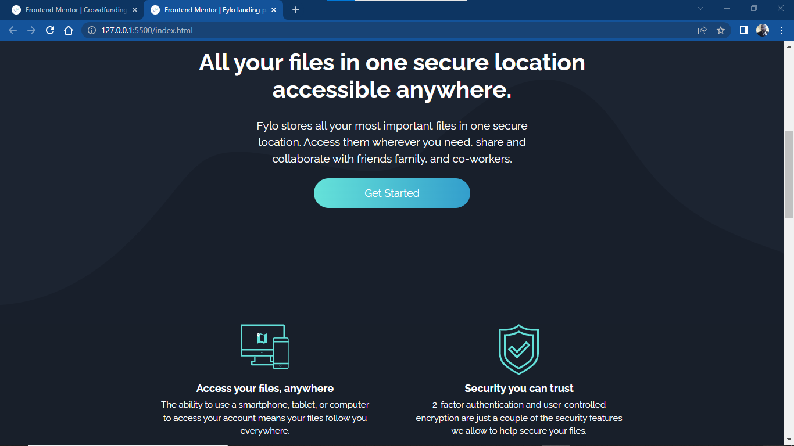

# Frontend Mentor - Fylo dark theme landing page solution

This is a solution to the [Fylo dark theme landing page challenge on Frontend Mentor](https://www.frontendmentor.io/challenges/fylo-dark-theme-landing-page-5ca5f2d21e82137ec91a50fd). Frontend Mentor challenges help you improve your coding skills by building realistic projects.

## Table of contents

- [Overview](#overview)
  - [The challenge](#the-challenge)
  - [Screenshot](#screenshot)
  - [Links](#links)
- [My process](#my-process)
  - [Built with](#built-with)
  - [What I learned](#what-i-learned)
  - [Continued development](#continued-development)
  - [Useful resources](#useful-resources)
- [Author](#author)
- [Acknowledgments](#acknowledgments)

## Overview

### The challenge

Users should be able to:

- View the optimal layout for the site depending on their device's screen size
- See hover states for all interactive elements on the page

### Screenshot





### Links

- Solution URL: [www.saajevessolutionforthisproject.com](https://github.com/SAAJEVES/FrontendMentor-challenge-on-JS-J04)
- Live Site URL: [www.saajeveslivesiteforthisproject.com](https://saajeves.github.io/FrontendMentor-challenge-on-JS-J04/)

## My process

### Built with

- Semantic HTML5 markup
- CSS custom properties
- Flexbox

### What I learned

I learnt more on regular expressions and its methods.

```JS
const regexTest = /^\w+([\.-]?\w+)*@\w+([\.-]?\w+)*(\.\w{2,3})+$/;
```

### Continued development

Development on html, css and js still needed.

### Useful resources

A lot of resources was helpful not just in this project but from the beginning of my learning of web development.

- [w3schools](https://www.w3schools.com)

- [freecodecamp](https://www.freecodecamp.com)

- [youtube](https://www.youtube.com)

- And lots more. Surely, I will always recommend them days in and days out

## Author

- Github - [go to my github account](https://github.com/SAAJEVES)
- Frontend Mentor - [go to my frontend mentor account](https://www.frontendmentor.io/profile/SAAJEVES)
- Twitter - [go to my twitter account](https://www.twitter.com/saajeves)
- LinkedIn - [go to my linkedin account](https://www.linkedin.com/in/samuel-ajagun-020283150)

## Acknowledgments

I would love to acknowledge [a very good friend of mine and mentor](https://github.com/wisdomosara) for his immense contribution on helping me in this project. You are well appreciated.
